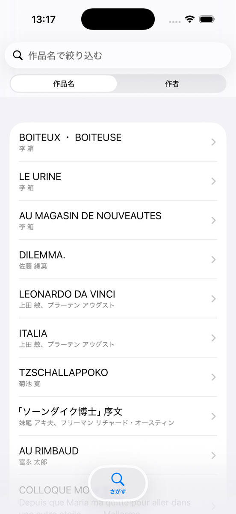
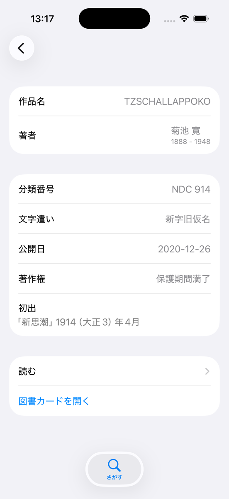
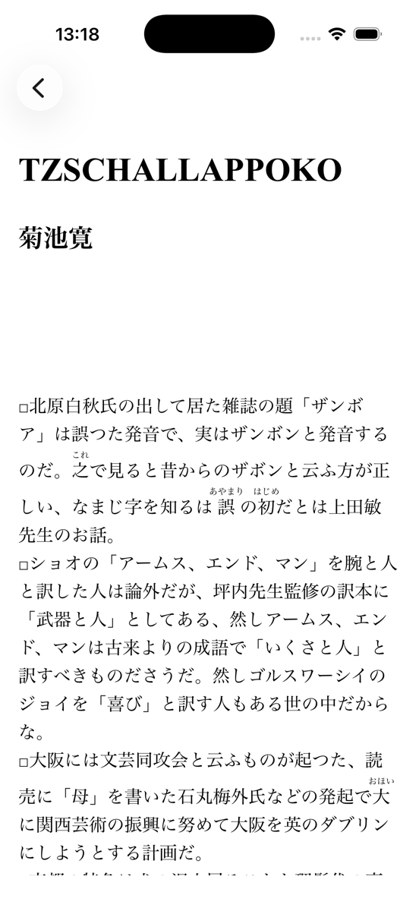

# AozoraReader

青空文庫の作品を探して読むための iOS アプリ。

| さがすタブ | 作品詳細 | リーダー |
|---|---|---|
|  |  |  |

## 構成

`AozoraReaderClient` が iOS アプリ、`AozoraReaderMockServer` が Vapor + SQLite のモックサーバー。

青空文庫が配っている[作品リスト CSV](https://www.aozora.gr.jp/index_pages/person_all.html) を
SQLite にして、モックサーバーが API で配る。

## 技術構成

- SwiftPM のマルチモジュール構成
- 画面ごとの Feature モジュール
- Swift OpenAPI Generator で [`openapi.yaml`](AozoraReaderMockServer/Sources/openapi.yaml) からクライアントとモックサーバーの両方を生成
- Swift Testing

## 起動

モックサーバーを先に起動する。

```bash
swift run --package-path AozoraReaderMockServer
```

`http://localhost:8080/api` で待ち受ける。あとは `AozoraReaderClient/AozoraReaderClient.xcodeproj`
を Xcode で開いて実行する。

## ドキュメント

[doc/README.md](doc/README.md) から。画面ごとの仕様と、データの素性をまとめている。
