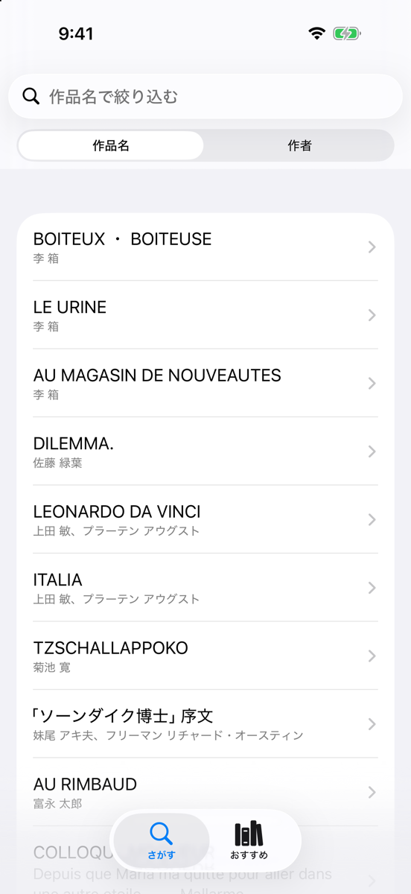
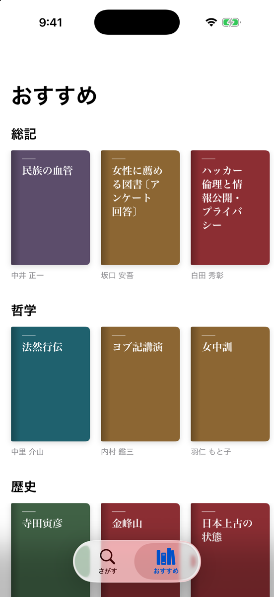
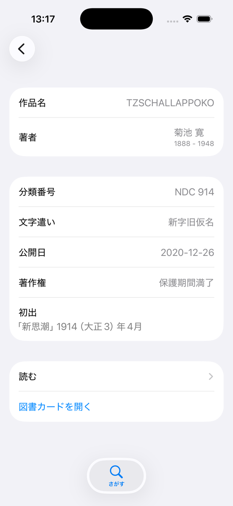
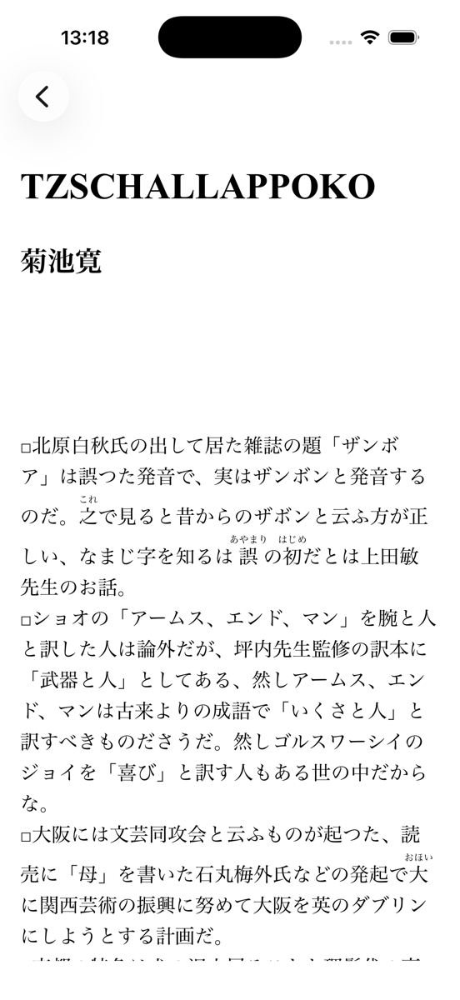

# AozoraReader

青空文庫の作品を探して読むための iOS アプリ。

| さがすタブ | おすすめタブ | 作品詳細 | リーダー |
|---|---|---|---|
|  |  |  |  |

## 構成

`AozoraReaderClient` が iOS アプリ、`AozoraReaderMockServer` が Vapor + SQLite のモックサーバー。

青空文庫が配っている[作品リスト CSV](https://www.aozora.gr.jp/index_pages/person_all.html) を
SQLite にして、モックサーバーが API で配る。
青空文庫には公式の API が無いので、アプリを作りやすいようにモックサーバーを立てた。

## 技術構成

- SwiftPM のマルチモジュール構成
  - 依存関係を整理して、画面の変更が別の画面に、データの取り方の変更が画面に、波及しないようにした
  - コードが増えても、差分ビルドで作り直す範囲が広がらないように、モジュールを小さく分けた
- 画面ごとの Feature モジュール
  - Preview やテストで画面を確かめるときに、アプリ全体をビルドしなくて済むようにした
- Swift OpenAPI Generator で [`openapi.yaml`](AozoraReaderMockServer/Sources/openapi.yaml) からクライアントとモックサーバーの両方を生成
  - API クライアントを手で書くと、書く人によって実装がばらつき、読みにくく変えにくくなる。`openapi.yaml` から生成して、人によるブレをなくした
- Swift Testing

## 起動

モックサーバーを先に起動する。

```bash
swift run --package-path AozoraReaderMockServer
```

`http://localhost:8080/api` で待ち受ける。あとは `AozoraReaderClient/AozoraReaderClient.xcodeproj`
を Xcode で開いて実行する。

## ドキュメント

[doc/README.md](doc/README.md) から。画面ごとの仕様と、データの素性をまとめている。

## 画面マップ（E2E）

[`screen-map/screens/`](screen-map/screens) に、画面ごとに何ができて、操作するとどうなるかを置いている。
シミュレーターでの動作確認は、ここに書いたアクセシビリティ ID と遷移をもとに導線を組む。

画面マップの作成と動作確認には、Claude Code の Skill を使っている。
Skill は [claude-ios-e2e-skills](https://github.com/tx-TEM/claude-ios-e2e-skills) にまとめてある。

| 画面 | 画面マップ |
|---|---|
| さがすタブ | [browse.yaml](screen-map/screens/browse.yaml) |
| おすすめタブ | [recommend.yaml](screen-map/screens/recommend.yaml) |
| 作品詳細 | [detail.yaml](screen-map/screens/detail.yaml) |
| リーダー | [reader.yaml](screen-map/screens/reader.yaml) |
